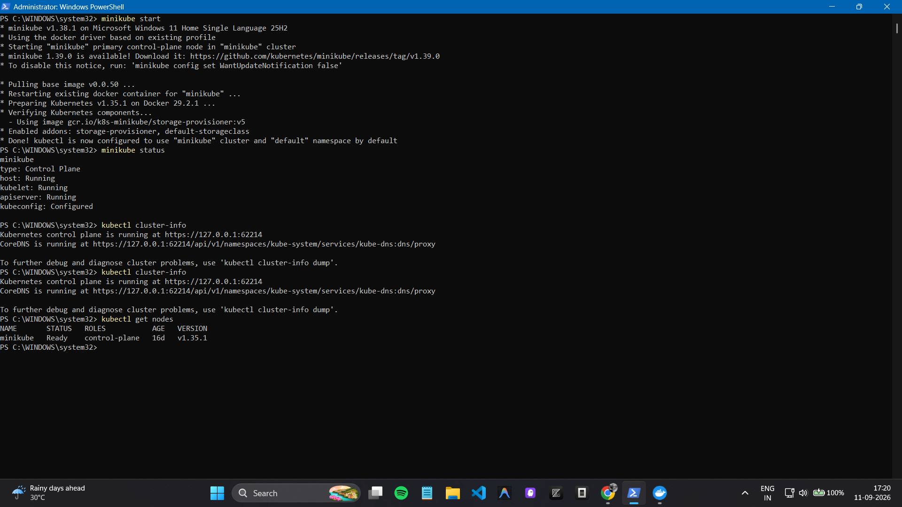
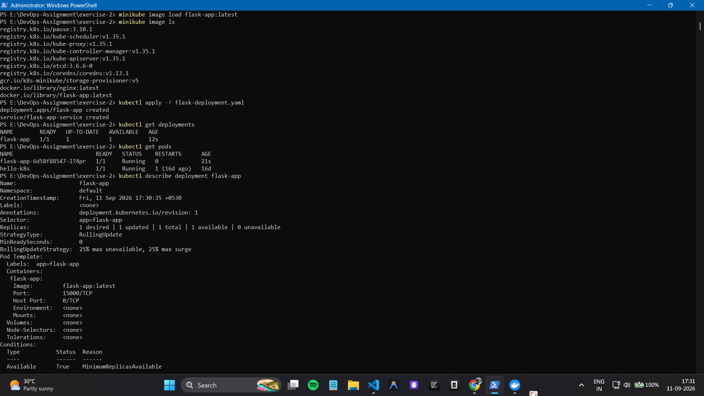
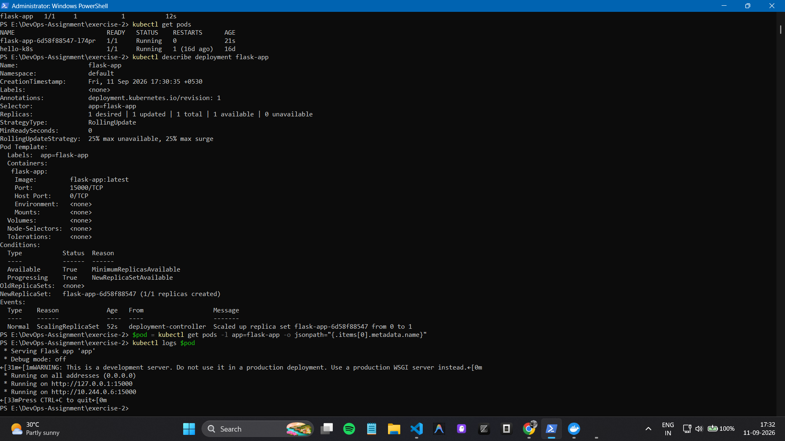
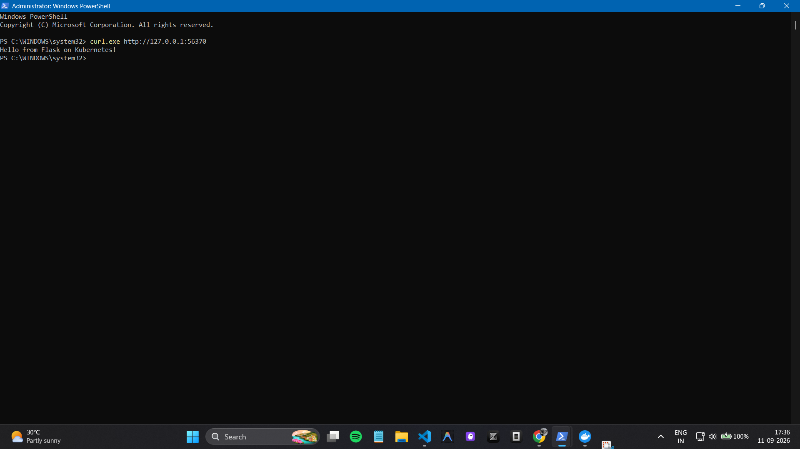

# Flask App Deployment on Minikube

This assignment demonstrates how to deploy a simple **Flask application
on Kubernetes using Docker, Minikube, and kubectl on Windows
PowerShell**.

## Technologies Used

-   Python / Flask
-   Docker
-   Kubernetes
-   Minikube
-   kubectl
-   Windows PowerShell

## Project Structure

``` text
DevOps-Assignment/
├── app.py
├── Dockerfile
├── flask-deployment.yaml
├── README.md
└── images/
    ├── 01-minikube.png
    ├── 02-deployment-pods.png
    ├── 03-flask-logs.png
    └── 04-service.png
```

## 1. Start Minikube

Minikube was started using the Docker driver on Windows.

``` powershell
minikube start
minikube status
kubectl cluster-info
kubectl get nodes
```



## 2. Flask Application

The Flask application runs on port **15000** and returns:

``` text
Hello from Flask on Kubernetes!
```

The application was containerized using Docker with the
`flask-app:latest` image.

## 3. Kubernetes Deployment

The application was deployed using `flask-deployment.yaml`.

``` powershell
docker build -t flask-app .
minikube image load flask-app:latest
kubectl apply -f flask-deployment.yaml
```

The Deployment creates one replica of the Flask application.



## 4. Application Logs

The Flask Pod was verified using Kubernetes logs.

``` powershell
kubectl logs <pod-name>
```

The logs confirm that Flask is running on port **15000**.



## 5. Kubernetes Service

A **NodePort Service** was configured to expose the Flask application:

``` yaml
port: 15000
targetPort: 15000
type: NodePort
```

The service was accessed using:

``` powershell
minikube service flask-app-service --url
```

## 6. Final Result

The application was successfully accessed through the Minikube service.

``` powershell
curl.exe http://127.0.0.1:<PORT>
```

Output:

``` text
Hello from Flask on Kubernetes!
```



## Conclusion

The Flask application was successfully containerized with Docker and
deployed on a local Kubernetes cluster using Minikube. The application
was exposed using a Kubernetes NodePort Service and successfully
accessed from Windows PowerShell.
