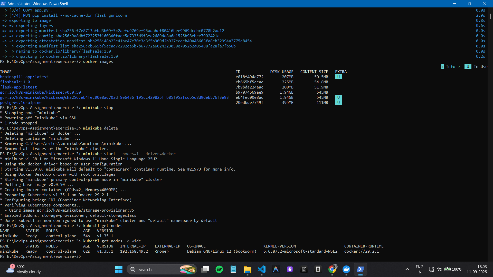
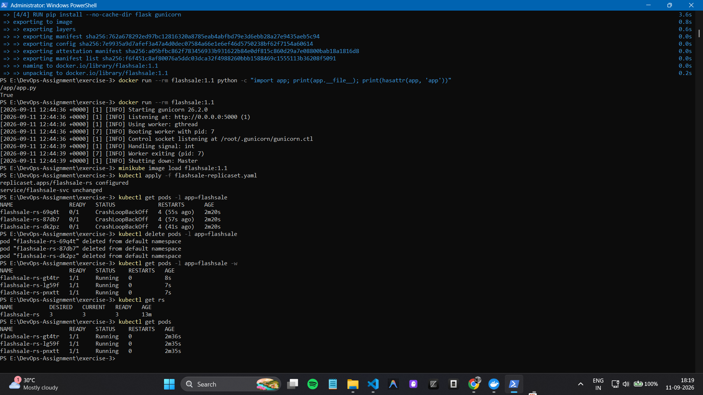
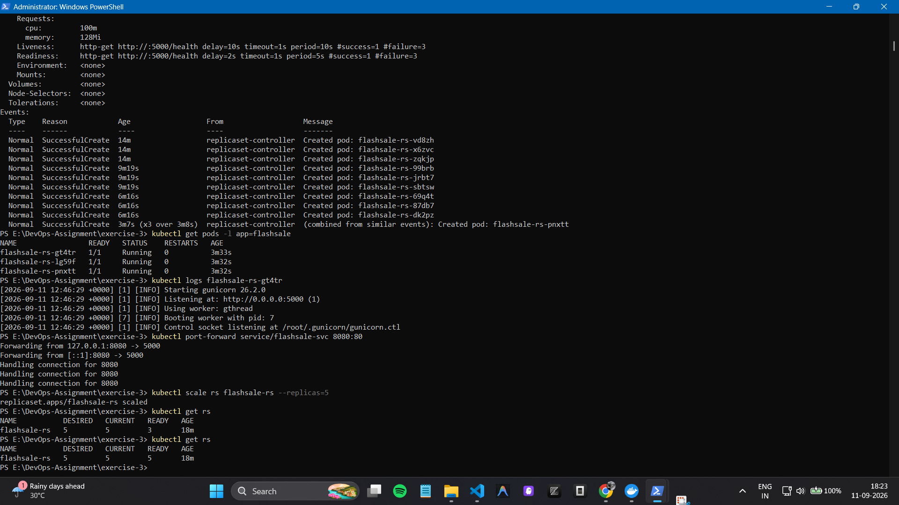
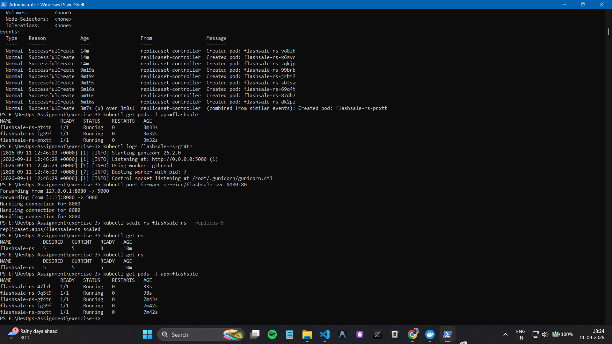
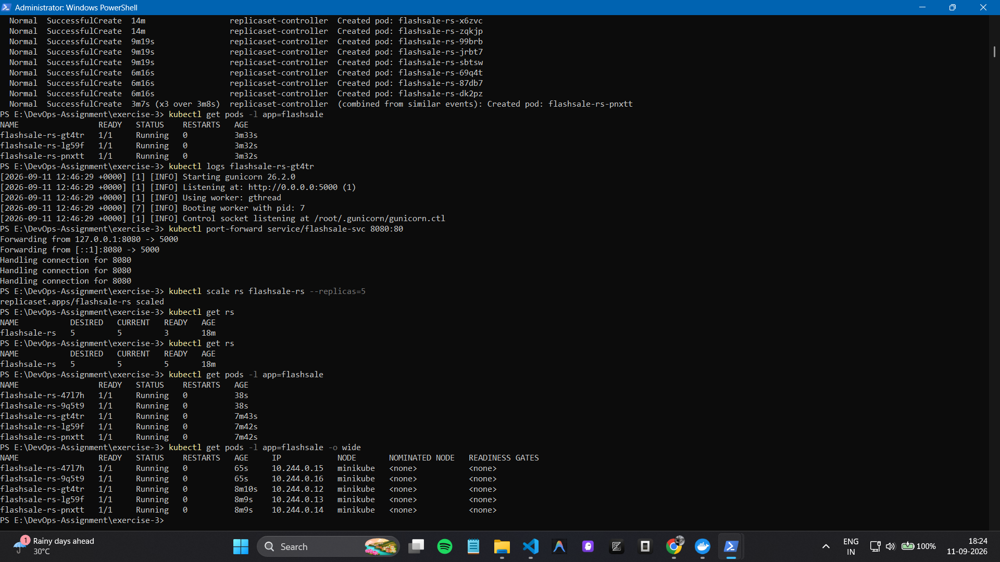
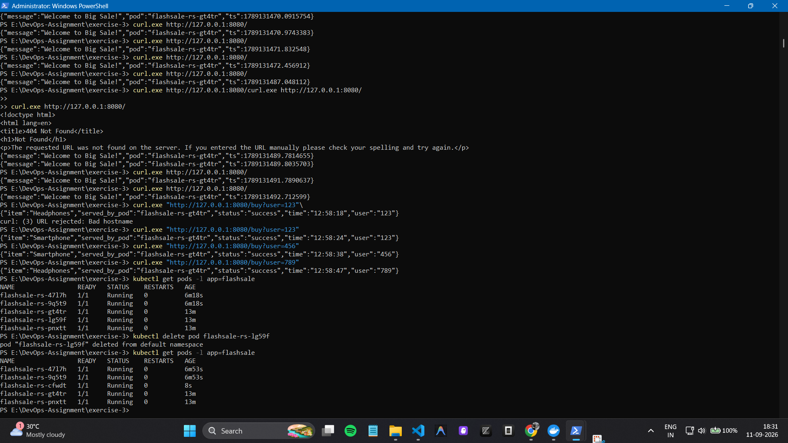
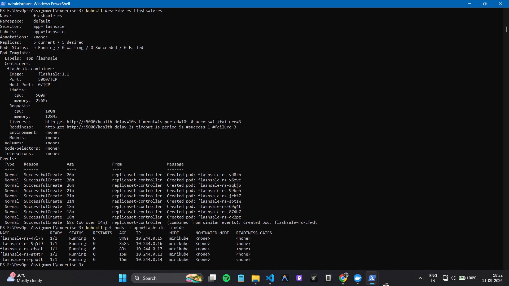

# Exercise 3: Scaling Flask App on Single Node using ReplicaSets

## Objective
Deploy a Flask flash-sale application using a Kubernetes ReplicaSet, scale it from 3 to 5 replicas, test the application, and demonstrate ReplicaSet self-healing on a single-node Minikube cluster.

## Technologies
- Python Flask
- Docker Desktop
- Minikube
- Kubernetes / kubectl
- Gunicorn
- Windows PowerShell

## 1. Minikube Single-Node Cluster

Minikube was started with one node using the Docker driver.



## 2. Initial ReplicaSet

The ReplicaSet was deployed with an initial desired replica count of **3**.

```powershell
kubectl apply -f flashsale-replicaset.yaml
kubectl get rs
```



## 3. Scale ReplicaSet to 5

The ReplicaSet was scaled from 3 to 5 replicas:

```powershell
kubectl scale rs flashsale-rs --replicas=5
```

Kubernetes created two additional Pods.



## 4. Five Running Pods

The application was verified with five running Pods:

```powershell
kubectl get pods -l app=flashsale
```



## 5. Pod Distribution

Pod placement was checked using:

```powershell
kubectl get pods -l app=flashsale -o wide
```

All five Pods were running on the single `minikube` node.



## 6. ReplicaSet Self-Healing

One Pod was manually deleted:

```powershell
kubectl delete pod <POD_NAME>
```

The ReplicaSet automatically created a replacement Pod to maintain the desired replica count.



## 7. Final Pod Distribution

The final state was verified with:

```powershell
kubectl get pods -l app=flashsale -o wide
```

Five Pods were running successfully on the single `minikube` node.



## Conclusion

This exercise demonstrates Kubernetes **replication, scaling, Pod distribution, and self-healing** using a Flask application and ReplicaSet on a single-node Minikube cluster.
