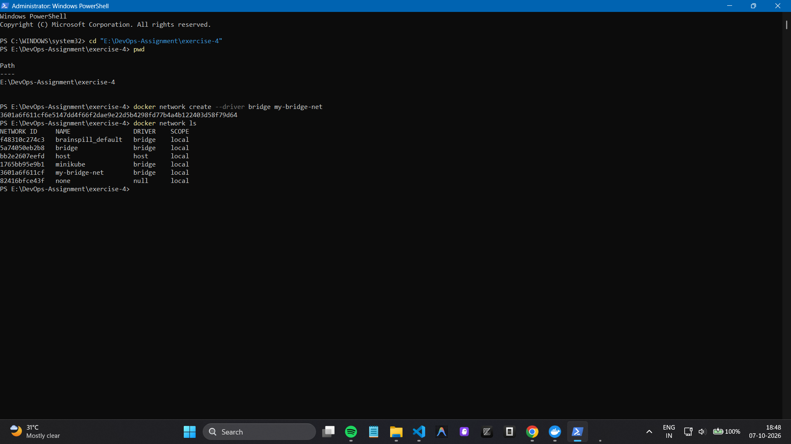
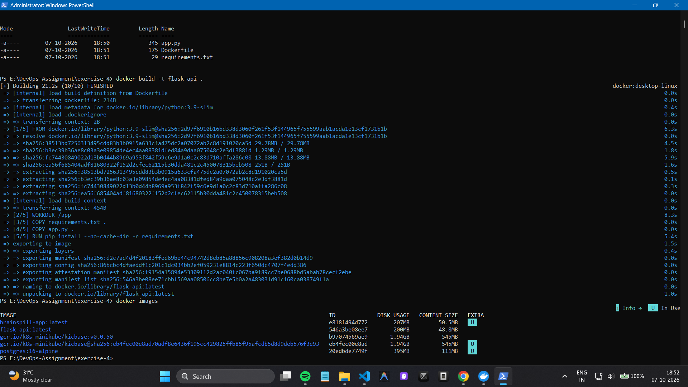
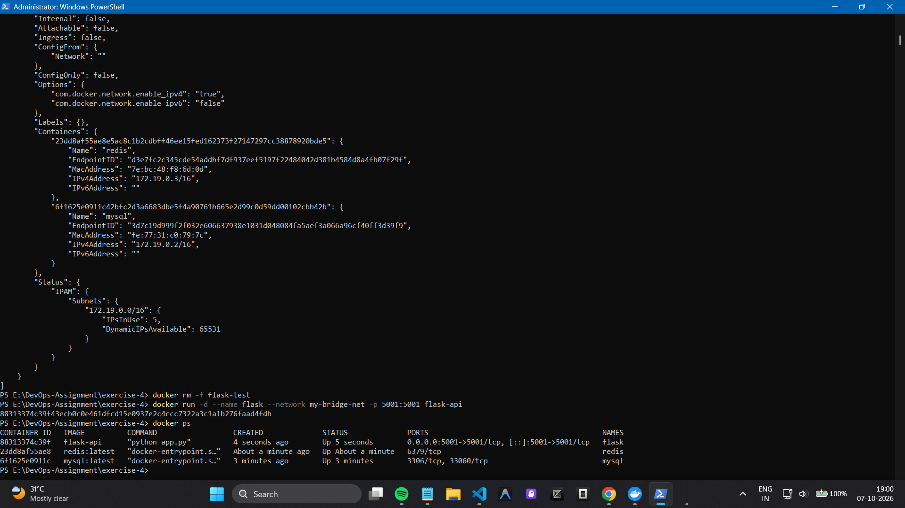
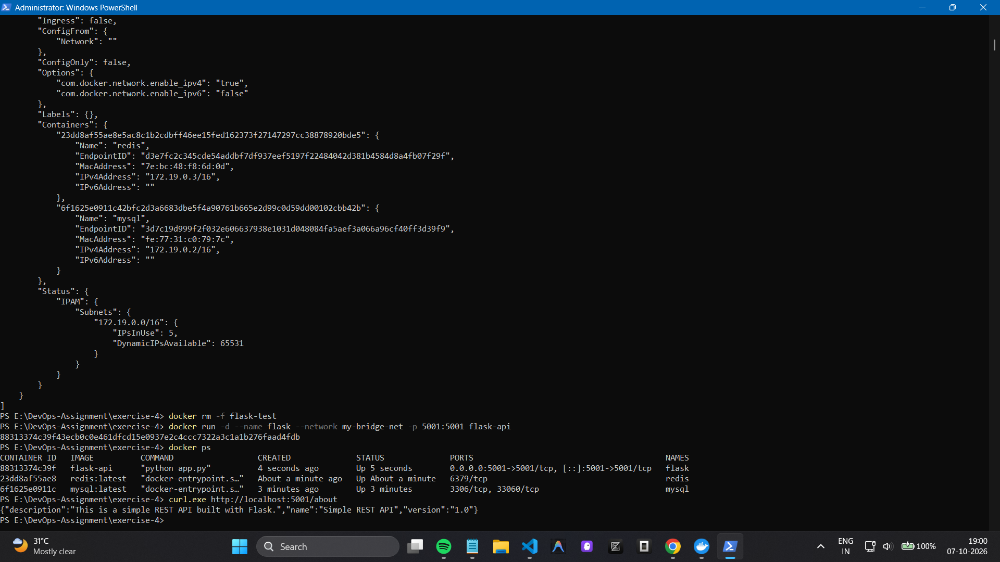
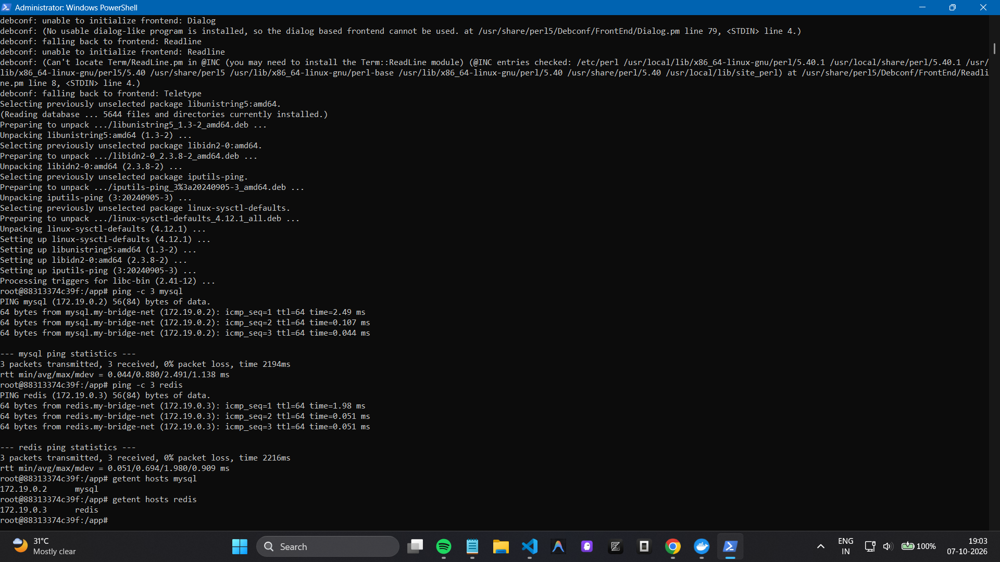
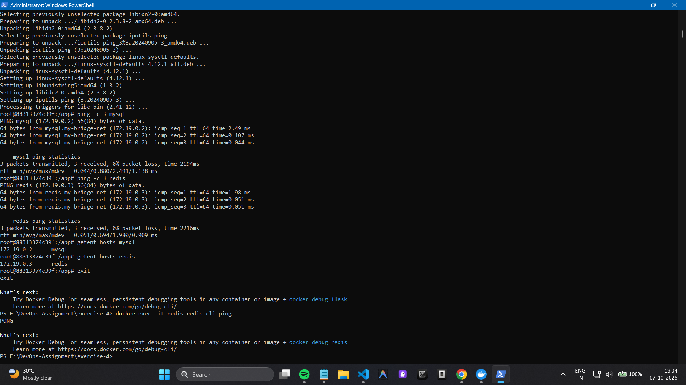
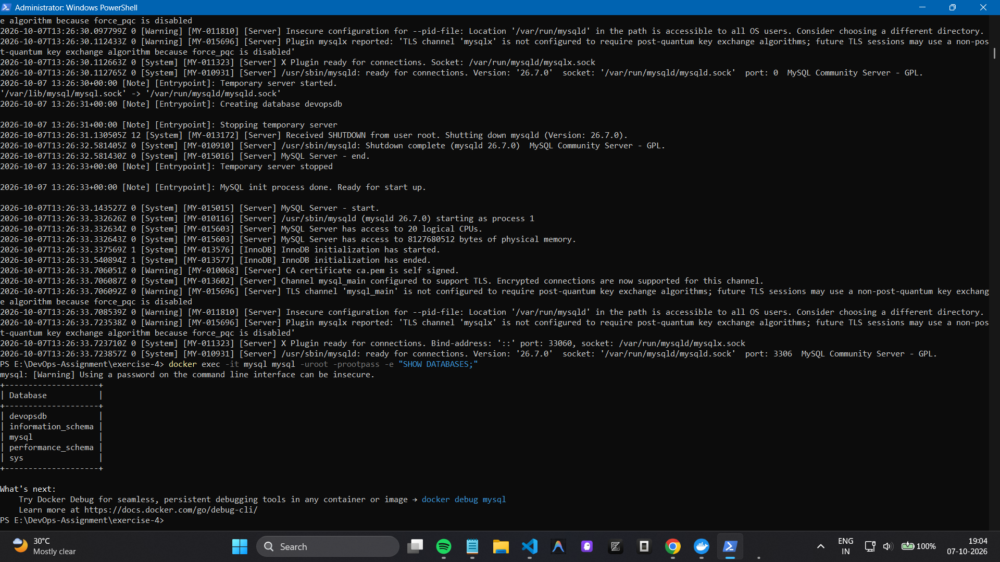

# Docker Networking Lab

## Overview

This lab demonstrates Docker networking using a Flask API, MySQL
database, and Redis cache connected through a custom user-defined bridge
network.

### Key Concepts

-   Creating a custom Docker bridge network
-   Building and running a Flask Docker image
-   Running Flask, MySQL, and Redis containers
-   Host-to-container port publishing
-   Container-to-container communication
-   Docker DNS / service discovery using container names

## Environment

-   Windows
-   Docker Desktop
-   PowerShell

## Key Results

The following screenshots document the important execution steps and
successful outcomes.

### 1. Custom Docker Network

The custom bridge network `my-bridge-net` was created successfully.



### 2. Flask Docker Image

The Flask application image `flask-api` was built successfully.



### 3. Three Containers Running

Flask, MySQL, and Redis were successfully started and are running
together.



### 4. Flask API Test

The Flask API was accessed from the Windows host through the published
port `5001`.



### 5. Docker DNS / Service Discovery

The Flask container successfully resolved the `mysql` and `redis`
containers by name using Docker's internal DNS.



### 6. Redis Verification

Redis responded successfully with `PONG`.



### 7. MySQL Verification

MySQL was successfully initialized, including the `devopsdb` database.



## Final Architecture

``` text
Windows Host
    |
    | localhost:5001
    v
  Flask
    |
    | my-bridge-net
    |
    +---- MySQL
    |
    +---- Redis
```

The lab demonstrates that the Flask service can be exposed to the host
using port publishing while communicating with MySQL and Redis
internally through the user-defined Docker network.

## Conclusion

The Docker networking lab was completed successfully. The custom bridge
network, three-container application, port publishing, container
communication, and Docker DNS-based service discovery were verified.
