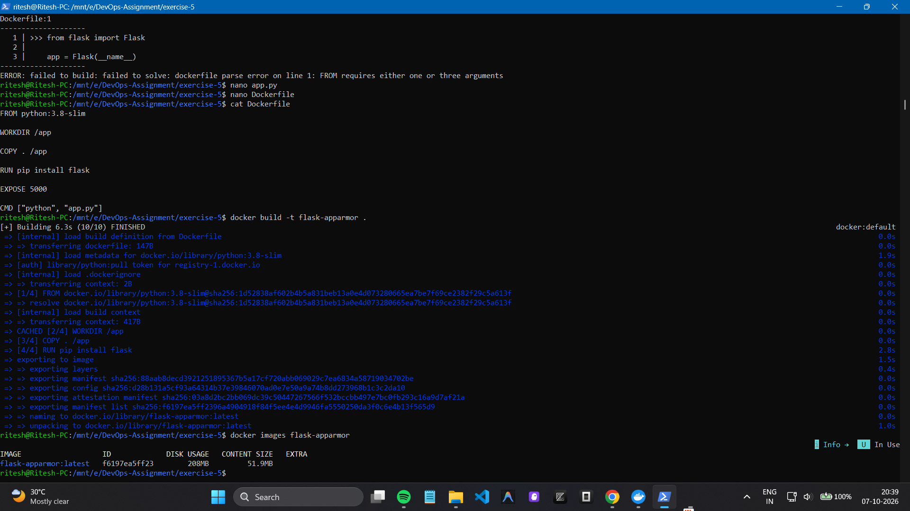
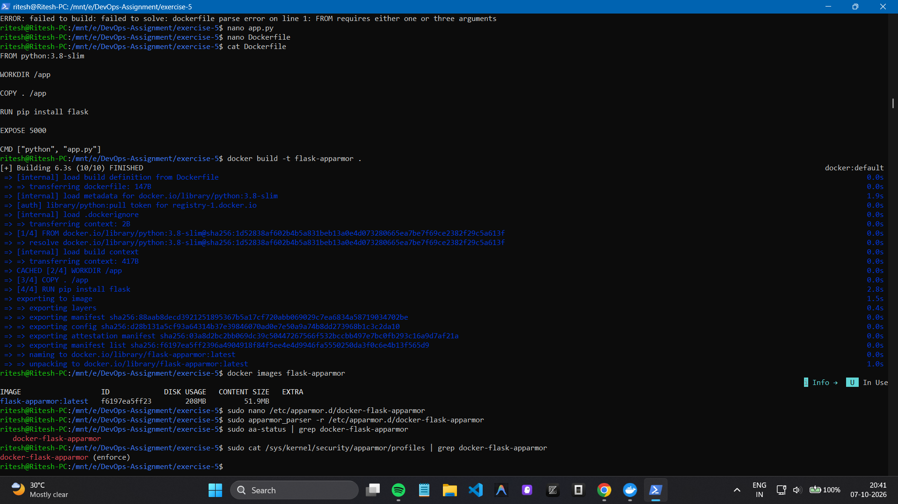
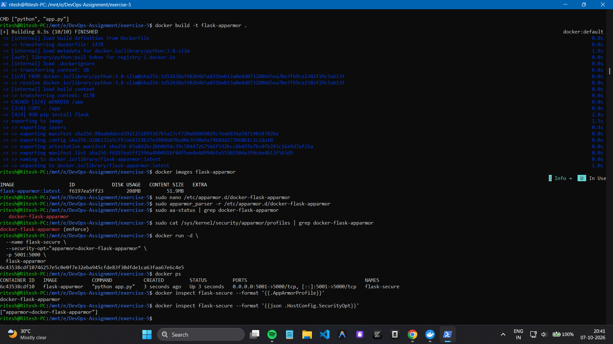
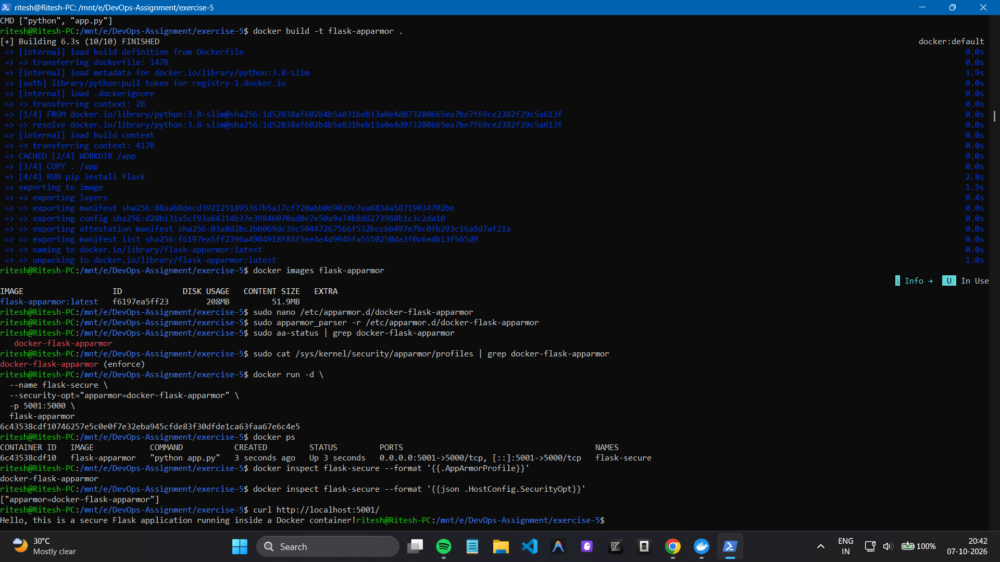
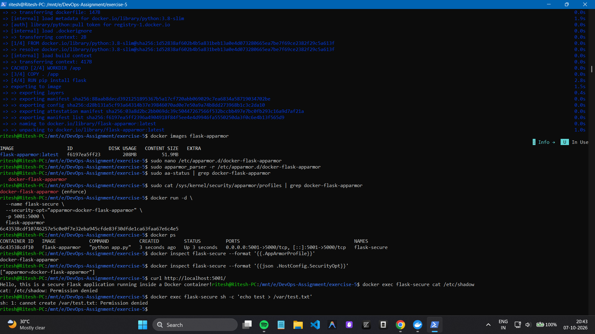
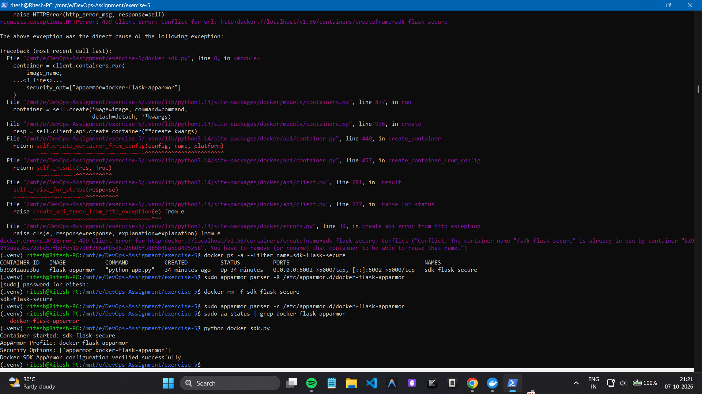

# Docker AppArmor Security Lab

## Overview

This lab demonstrates container security using **Docker, Flask, and
AppArmor**. A custom AppArmor profile was created and applied to a Flask
container to restrict access to sensitive files, directories, and
administrative capabilities.

### Key Concepts

-   Creating a custom AppArmor security profile
-   Running a Flask application inside Docker
-   Applying AppArmor profiles to Docker containers
-   Restricting access to sensitive files and directories
-   Verifying AppArmor enforcement
-   Managing secured containers using the Docker SDK for Python

## Environment

-   Windows
-   WSL2
-   Ubuntu 24.04
-   Docker Engine
-   AppArmor
-   Python

## Key Results

The following screenshots document the important execution steps and
successful outcomes.

### 1. Docker Image Build

The Flask application image `flask-apparmor` was built successfully.



### 2. AppArmor Profile Loaded

The custom `docker-flask-apparmor` profile was successfully loaded and
enforced.



### 3. Flask Container Running with AppArmor

The Flask container was successfully started with the
`docker-flask-apparmor` security profile.



### 4. Flask Application Test

The Flask application was successfully accessed through the published
port `5001`.



### 5. AppArmor Restrictions

AppArmor successfully denied access to restricted resources such as
`/etc/shadow` and prevented modifications under `/var/`.



### 6. Docker SDK Verification

The Docker SDK for Python successfully launched a container and verified
that the AppArmor profile was applied.



## Final Architecture

``` text
Windows Host
     |
     | WSL2 / Ubuntu
     v
Docker Engine
     |
     | AppArmor Profile
     v
Flask Container
     |
     | Port 5001 -> 5000
     v
Flask Application
```

The AppArmor profile provides an additional security layer by allowing
the Flask application to run while restricting access to sensitive
system resources and administrative capabilities.

## Conclusion

The Docker AppArmor security lab was completed successfully. The Flask
application was containerized, secured using a custom AppArmor profile,
tested against restricted operations, and verified programmatically
using the Docker SDK for Python.
